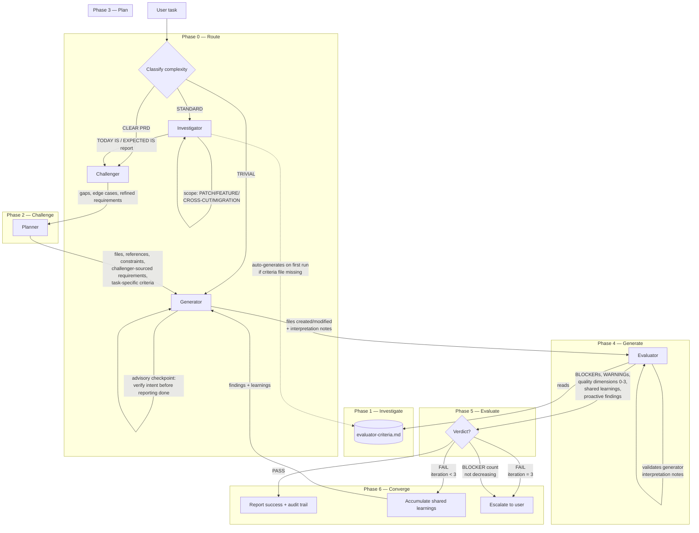
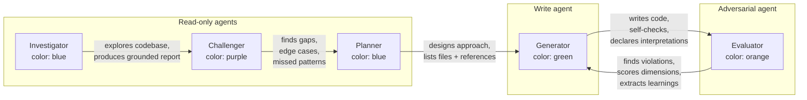

# Forge Pipeline Architecture

The forge implement skill orchestrates five agents in a sequential pipeline with dynamic routing, advisory checkpoints, and cross-iteration learning.

## Pipeline Overview

## Agent Roles

All agents inherit the session model — no hardcoded overrides.
The pipeline is as intelligent as the session allows.
This was changed after observing that sonnet produces noticeably weaker analysis than opus in challenger and evaluator roles.

## Routing

| Route | When | Agents | Typical use |
|-------|------|--------|-------------|
| TRIVIAL | 1 file, obvious change, no design decisions | Generator → Evaluator | Typo in a rule, config value change |
| CLEAR PRD | User provided detailed spec with requirements and edge cases | Challenger → Planner → Generator → Evaluator | Well-specified feature ticket |
| STANDARD | Needs codebase exploration, has ambiguity, touches multiple files | All five agents | New feature, cross-cutting refactor |

## Feedback Mechanisms

```mermaid
flowchart TD
    subgraph "Sprint Contract"
        GEN3[Generator] -->|"Interpretation Notes:<br/>how ambiguous rules<br/>were read"| EVAL3[Evaluator]
        EVAL3 -->|"validates interpretations,<br/>flags mismatches as BLOCKERs"| GEN3
    end

    subgraph "Cross-Iteration Learning"
        EVAL4[Evaluator] -->|"Shared Learnings:<br/>reusable patterns"| ACCUM[Implement skill<br/>accumulates learnings]
        ACCUM -->|"all prior learnings"| GEN4[Generator<br/>next iteration]
    end

    subgraph "Quality Dimensions"
        EVAL5[Evaluator] -->|"Convention: 2/3<br/>Tests: 1/3<br/>Patterns: 3/3<br/>Completeness: 2/3"| GEN5[Generator<br/>knows WHERE<br/>to improve]
    end

    subgraph "Reconciliation"
        GEN6[Generator] -->|"Plan says X,<br/>but codebase has Y.<br/>I followed Y because..."| IMPL[Implement skill<br/>reviews deviation]
        IMPL -->|significant?| USER2[Ask user]
    end
```

## Tool Detection

Agents detect available tools at runtime — nothing is assumed.

| Tool | Detection method | Agents that detect |
|------|-----------------|-------------------|
| SonarQube MCP | env `SONARQUBE_URL` | Evaluator, Challenger |
| Build command | Check for `nx`, `mvn`, `gradle`, `npm` in project | Evaluator |
| Test runner | Check for test configs (`jest.config`, `pom.xml`, etc.) | Evaluator |
| Linter | Check for lint configs (`.eslintrc`, `spotless`, etc.) | Evaluator |

If a tool is unavailable, the evaluator reports NOT RUN with the reason.
The pipeline degrades gracefully — missing tools don't cause failures.

## Criteria Lifecycle

The evaluator criteria file at `.claude/forge/evaluator-criteria.md` is a versioned project artifact.

| Event | What happens |
|-------|-------------|
| First run, no criteria exists | Investigator auto-generates from CLAUDE.md, rules/, and codebase patterns |
| Challenger finds missing convention | Suggests addition in challenge report |
| Tool becomes unavailable | Evaluator notes it, does not fail |
| User wants to update | Edit the file directly — it's a project artifact |

## Evaluator Output Structure

The evaluator produces these sections in order:

1. **Verdict** — PASS or FAIL
2. **Iteration** — X/3
3. **BLOCKERs (Tier 1)** — rule violations with file:line, cause FAIL
4. **WARNINGs (Tier 2)** — quality suggestions, informational only
5. **Task-Specific BLOCKERs** — planner/challenger requirements not met, cause FAIL
6. **Dynamic Checks** — three-state: PASS / FAIL / NOT RUN (with reason)
7. **Proactive Findings** — adjacent issues, don't affect verdict
8. **Shared Learnings** — patterns for the next iteration
9. **Quality Dimensions** — four 0-3 scores, don't affect verdict
10. **Tool Availability** — what was detected and used
11. **Summary** — counts + dimension scores

## Convergence Rules

- BLOCKER count = 0 → **PASS**
- BLOCKER count > 0, iteration < 3 → **FAIL**, loop with findings + learnings
- BLOCKER count > 0, iteration = 3 → **FAIL**, escalate to user
- BLOCKER count not decreasing → escalate immediately (stuck detection)
- WARNINGs and quality dimension scores are informational — they don't cause FAIL

## Pipeline Metrics (audit trail)

Each run appends metrics to `.agents.tmp/forge/feedback-YYYYMMDD-{description}.md`:

- Route taken, agents used, iterations needed
- Final quality dimensions
- Per-agent value: key contribution + "could skip?" assessment
- Reconciliations where generator contradicted the plan

Over time these metrics show which agents justify their cost and whether routing thresholds need adjustment.
