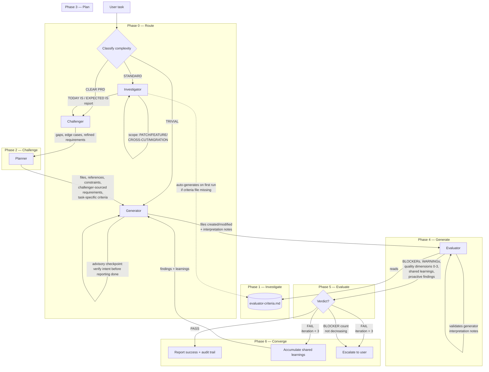
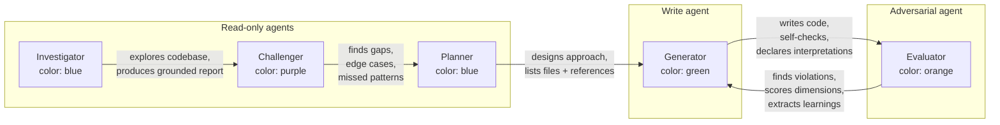
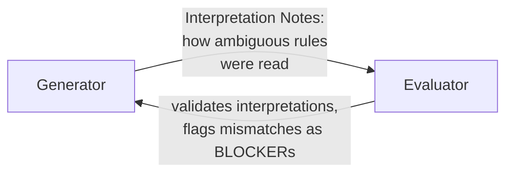
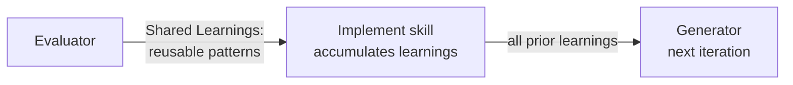
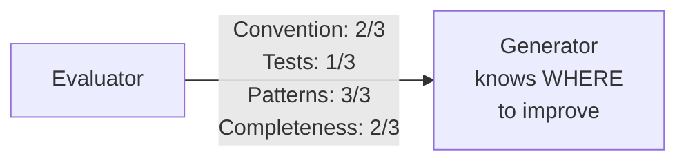
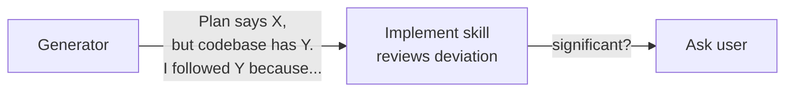

# Forge Pipeline Architecture

The forge implement skill orchestrates five agents in a sequential pipeline with dynamic routing, advisory checkpoints, and cross-iteration learning.

## Design Philosophy

The forge pipeline is built on four principles from agent design research.
Each principle solves a specific failure mode observed in AI-assisted code generation.

### Separate generation from evaluation

When the same agent writes code and judges its quality, it praises its own mediocre output.
Splitting these roles into a dedicated Generator and a dedicated Evaluator creates adversarial tension — the Generator tries to produce code that passes, the Evaluator tries to find real violations.
This is the same insight behind Generative Adversarial Networks: the generator improves because the evaluator keeps raising the bar.

*Source: [Anthropic — Harness Design for Long-Running Apps](https://www.anthropic.com/engineering/harness-design-long-running-apps).
"Separating the agent doing the work from the agent judging it proves to be a strong lever."*

### Route complexity to match the task

Not every task needs five agents.
A typo fix doesn't need adversarial review, and a well-specified feature ticket doesn't need codebase exploration.
The pipeline classifies tasks into three routes (TRIVIAL, CLEAR PRD, STANDARD) and only activates the agents each route requires.
This keeps the pipeline as simple as the task demands, not as complex as the architecture allows.

*Source: [Anthropic — Building Effective Agents](https://www.anthropic.com/engineering/building-effective-agents).
"Start with the simplest solution possible, and only add complexity when empirically justified."*

### Calibrate evaluation with concrete examples

An evaluator without calibration drifts — it either rubber-stamps everything or invents problems to justify its existence.
The forge evaluator uses few-shot calibration examples showing exactly what a BLOCKER, WARNING, false positive, and proactive finding look like.
Scored quality dimensions (Convention Adherence, Test Coverage, Pattern Consistency, Completeness) give the Generator holistic feedback beyond "fix this line."

*Source: [Microsoft — Multi-Model Intelligence in Researcher](https://techcommunity.microsoft.com/blog/microsoft365copilotblog/introducing-multi-model-intelligence-in-researcher/4506011).
Rubric-based evaluation across explicit dimensions produced +7.0 point improvement with p < 0.0001 statistical significance.*

### Consult before committing, not just after failing

The Generator has two advisory checkpoints — before starting substantive work and before declaring done.
These structured pause-and-verify moments catch approach-level mistakes that line-level self-checks miss.
When the Generator's codebase exploration contradicts the plan, it documents the conflict rather than silently deviating.

*Source: [Anthropic — Advisor Tool](https://platform.claude.com/docs/en/agents-and-tools/tool-use/advisor-tool).
"Call advisor BEFORE substantive work — before writing, before committing to an interpretation, before building on an assumption."*

### Make interpretation explicit, not implicit

The Generator and Evaluator both read the same criteria file, but they may interpret ambiguous rules differently.
Rather than letting this mismatch surface as repeated failures across iterations, the Generator declares its interpretations upfront and the Evaluator validates them.
This sprint contract pattern surfaces disagreements on iteration 1 instead of iteration 3.

*Source: [Anthropic — Harness Design for Long-Running Apps](https://www.anthropic.com/engineering/harness-design-long-running-apps).
Sprint contract pattern — generator and evaluator negotiate written contracts before implementation.*

## Pipeline Overview

## Agent Roles

| Agent | Model | Rationale |
|-------|-------|-----------|
| Investigator | opus | Report quality drives everything downstream |
| Challenger | opus | Adversarial role — weaker models miss real problems |
| Planner | opus | Plan quality directly affects generator output |
| Generator | session model (inherited) | User controls their coding session's capability |
| Evaluator | opus | Adversarial role — weaker models miss real problems |

## Routing

| Route | When | Agents | Typical use |
|-------|------|--------|-------------|
| TRIVIAL | 1 file, obvious change, no design decisions | Generator → Evaluator | Typo in a rule, config value change |
| CLEAR PRD | User provided detailed spec with requirements and edge cases | Challenger → Planner → Generator → Evaluator | Well-specified feature ticket |
| STANDARD | Needs codebase exploration, has ambiguity, touches multiple files | All five agents | New feature, cross-cutting refactor |

## Feedback Mechanisms

### Sprint Contract

The generator declares how it interpreted ambiguous rules.
The evaluator validates those interpretations and flags mismatches as BLOCKERs.
This surfaces disagreements on iteration 1 instead of wasting iterations converging silently.

### Cross-Iteration Learning

The evaluator extracts reusable patterns from each evaluation.
The implement skill accumulates learnings across iterations and passes all prior learnings to the generator on the next round.

### Quality Dimensions

Four scored axes (0-3) that tell the generator WHERE to improve holistically, not just WHAT line to fix.
Scores don't affect the verdict — only BLOCKERs cause FAIL.

### Reconciliation

When the generator's codebase exploration contradicts the plan's assumptions, it documents the conflict and reasoning.
The implement skill reviews the deviation and escalates significant ones to the user.

## Tool Detection

Agents detect available tools at runtime — nothing is assumed.

| Tool | Detection method | Agents that detect |
|------|-----------------|-------------------|
| SonarQube MCP | env `SONARQUBE_URL` | Evaluator, Challenger |
| Build command | Check for `nx`, `mvn`, `gradle`, `npm` in project | Evaluator |
| Test runner | Check for test configs (`jest.config`, `pom.xml`, etc.) | Evaluator |
| Linter | Check for lint configs (`.eslintrc`, `spotless`, etc.) | Evaluator |

If a tool is unavailable, the evaluator reports NOT RUN with the reason.
The pipeline degrades gracefully — missing tools don't cause failures.

## Criteria Lifecycle

The evaluator criteria file at `.agents/forge/evaluator-criteria.md` is a versioned project artifact.

| Event | What happens |
|-------|-------------|
| First run, no criteria exists | Investigator auto-generates from CLAUDE.md, rules/, and codebase patterns |
| Challenger finds missing convention | Suggests addition in challenge report |
| Tool becomes unavailable | Evaluator notes it, does not fail |
| User wants to update | Edit the file directly — it's a project artifact |

## Evaluator Output Structure

The evaluator produces these sections in order:

1. **Verdict** — PASS or FAIL
2. **Iteration** — X/3
3. **BLOCKERs (Tier 1)** — rule violations with file:line, cause FAIL
4. **WARNINGs (Tier 2)** — quality suggestions, informational only
5. **Task-Specific BLOCKERs** — planner/challenger requirements not met, cause FAIL
6. **Dynamic Checks** — three-state: PASS / FAIL / NOT RUN (with reason)
7. **Proactive Findings** — adjacent issues, don't affect verdict
8. **Shared Learnings** — patterns for the next iteration
9. **Quality Dimensions** — four 0-3 scores, don't affect verdict
10. **Tool Availability** — what was detected and used
11. **Summary** — counts + dimension scores

## Convergence Rules

- BLOCKER count = 0 → **PASS**
- BLOCKER count > 0, iteration < 3 → **FAIL**, loop with findings + learnings
- BLOCKER count > 0, iteration = 3 → **FAIL**, escalate to user
- BLOCKER count not decreasing → escalate immediately (stuck detection)
- WARNINGs and quality dimension scores are informational — they don't cause FAIL

## Pipeline Metrics (audit trail)

Each run appends metrics to `.agents.tmp/forge/feedback-YYYYMMDD-{description}.md`:

- Route taken, agents used, iterations needed
- Final quality dimensions
- Per-agent value: key contribution + "could skip?" assessment
- Reconciliations where generator contradicted the plan

Over time these metrics show which agents justify their cost and whether routing thresholds need adjustment.
